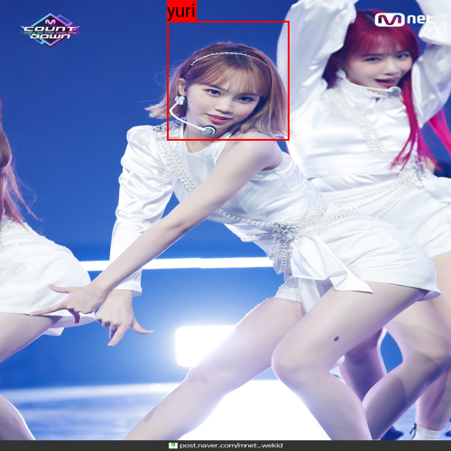
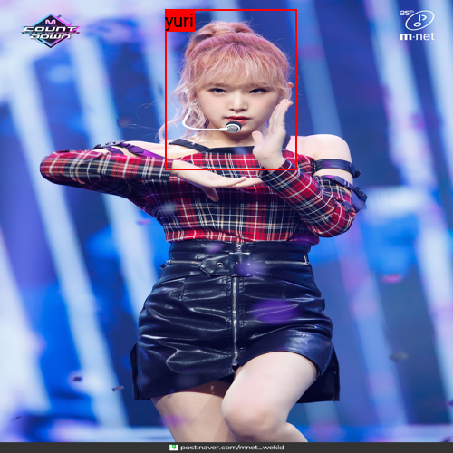
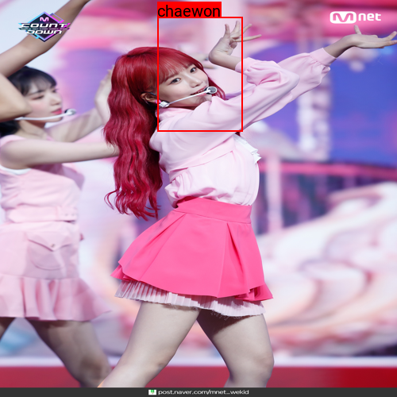
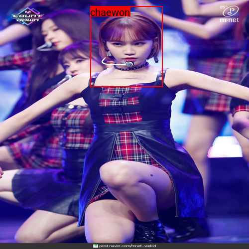
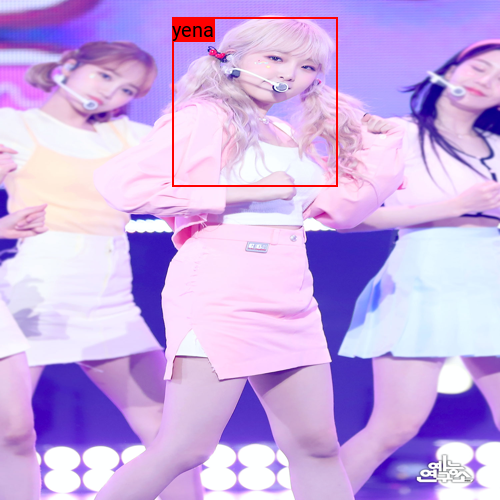
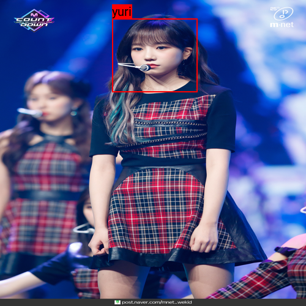

# IZ*Net

IZ*Net is the definitive way to differentiate between the Jo Yuriz trio!

    
    
    

Ok, the astute WIZ*One will notice that I have mislabelled all three girls, so let's try again:

    
    
    

Much better!

All jokes aside, IZ*Net is just a fun project I worked on to gain some experience with deep learning and CNNs.
You can read up about my adventure in the [writeup](writeup.pdf) I put together.
(Even if you don't care about deep learning and CNNs, I would recommend giving a brief look at Appendix A. I use a segment tree to pick uniformly random objects!)

For a bit of a more technical background, IZ*Net consists of two networks: one to detect faces using the YOLO algorithm and another to recognize the faces.

If you'd like to look at code:
- `faceRecognition` - Is a module I used to develop the face recognition model.
- `notebooks` - Contains my notebooks for this project
    - `FaceDetection.ipynb` - Develops the face detection model using the YOLO algorithm
    - `FaceRecognition.ipynb` - Develops the face recognition model
    - `IZ_NET.ipynb` - Develops the final system
    - `ObjectDetectionTest.ipynb` - Develops a rectangle detection model (used this to make sure I had implemented YOLO correctly)
    - `output.json` - The raw embeddings used for the face detection model (contains the true bounding boxes for the training set I used)
- `writeup` - All my LaTeX files, if for whatever reason you wanted to look at that
